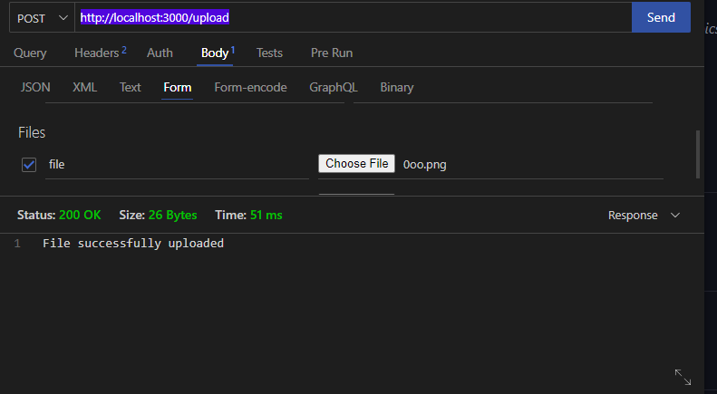
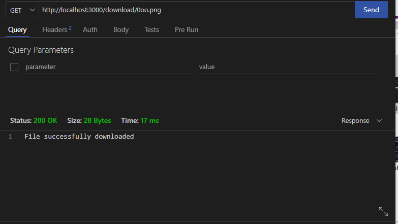

# goTask
# First create two folders, one called "downloads" and the other called "images"
# Run "go mod tidy"
# Run "go run main.go"
#
#
#
# For upload "localhost:3000/upload"

#
#
#
# For Download "localhost:3000/download/:filename"

#
#
#
# You can view the upload images in the "images" folder
# And the download images in the "downloads" folder